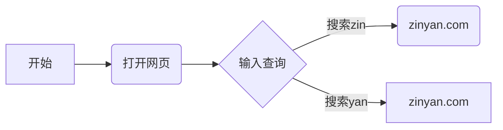
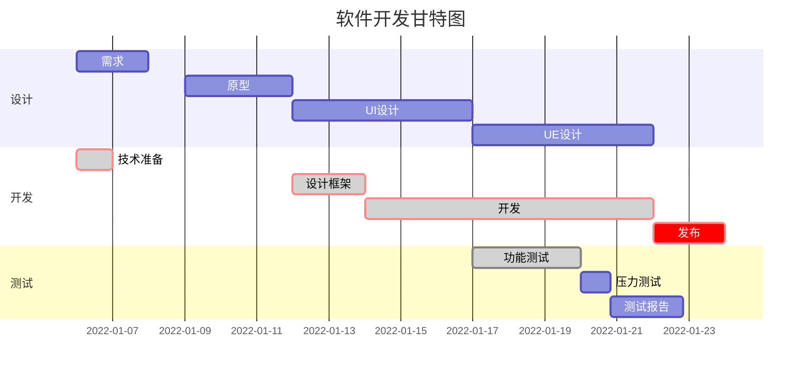
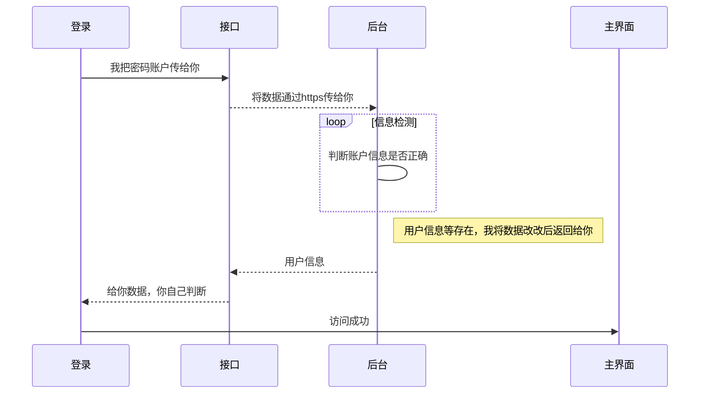

Markdown简明

[TOC]

一、标题
语法：#+空格+内容

# 一级标题
## 二级标题
### 三级标题
#### 四级标题
##### 五级标题
###### 六级标题

二、段落格式

粗体/斜体
*斜体*
**粗体**
***斜体+粗体***

分割线
***
---

删除线
~~删除~~

下划线
<u>下划线</u>

脚注
创建脚注格式类似这样 [^1]。
[^1]: 菜鸟教程 -- 学的不仅是技术，更是梦想！！！

三、列表

无序列表
语法：*+空格+内容  

（符号*可以用+或者-替代）
* 第一项
* 第二项

+ 第一项
+ 第二项

- 第一项
- 第二项

有序列表
语法：数字+.+空格+内容
1. 第一点
2. 第二点

嵌套列表
语法：4个空格+*+空格+内容
* 第一点
    * 第一小点
    * 第二小点
* 第二点

四、区块
语法：>+空格+内容
> 第一层
>> 第二层
>>> 第三层

五、代码
片段
`printf()`函数

代码块
```python
print("adcdefg")
print(123456)
```

六、超链接
这是一个链接 [知乎](https://www.zhihu.com/)

直接使用链接：<https://www.zhihu.com/>

七、图片


八、表格
| 表头   | 表头   |
| ------ | ------ |
| 单元格 | 单元格 |
| 单元格 | 单元格 |

| 左对齐 | 右对齐 | 居中对齐 |
| :----- | -----: | :------: |
| 单元格 | 单元格 |  单元格  |
| 单元格 | 单元格 |  单元格  |

九、数学公式
$\int_0^1 {x^2}{\rm d}x$

十、画图
流程图


```flow
st=>start: 开始框
op=>operation: 处理框
cond=>condition: 判断框(是或否?)
sub1=>subroutine: 子流程
io=>inputoutput: 输入输出框
e=>end: 结束框
st->op->cond
cond(yes)->io->e
cond(no)->sub1(right)->op
```

甘特图


UML 时序图

十一、其他
复选框
- [x] 选中状态
- [ ] 未选中状态

[Markdown基本语法](https://www.jianshu.com/p/191d1e21f7ed/)
[Markdown 各种标签介绍-一文了解各种markdown 脚本的使用](https://zinyan.com/?p=214)